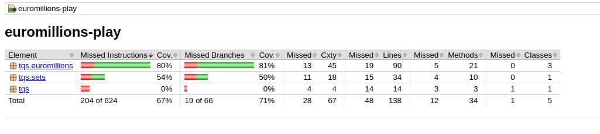
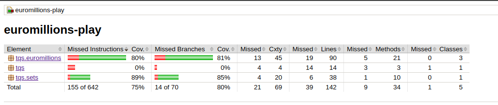

Com os teste fornecidos, os métodos que oferecem menos cobertura são o intersetcs(BoundedSetOfNaturals), add(int), equals(Object) e hashCode().

Para haver uma maior cobertura criei testes unitários adicionais para o add(int) para cobrir todas as possibilidades, implementei e criei testes para o intersetcs(BoundedSetOfNaturals).

