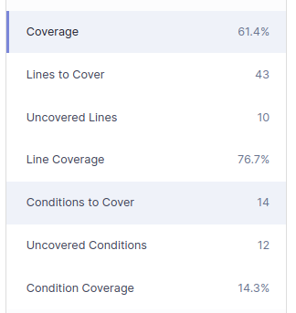

#### A)

- Technical debt found - 1h10m 
- It represents the cost (in terms of time) of solving all the issues listed, on average.

#### B)
Initially i had 3 code smells of high severity that were later fixed, showing this results:

#### C)

- There are 10 lines that are not covered from 43 total
- There are 12 conditions that are not covered from 14 total
- The percentage of covered lines is good but when we look at the uncovered conditions we have a percentage of 14,3% that is a bad number.
- I should have higher coverage because the major part of the lines and conditions that are not covered should be because they are business logic and could lead to errors in the future.
